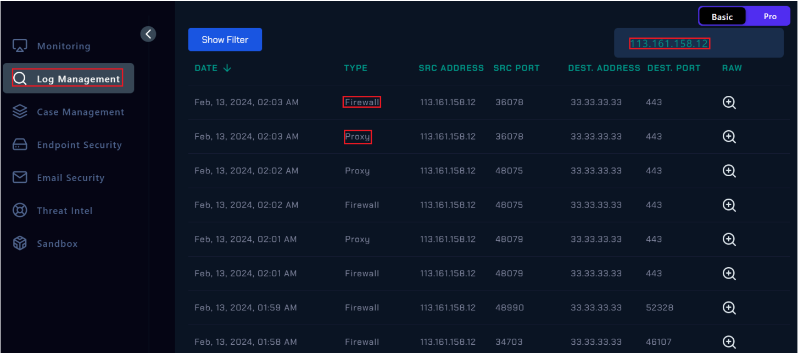

# Conexión VPN desde un país no autorizado.

Santiago D’Ovidio

Estudiante de la Tecnicatura Superior en Seguridad Informática - Instituto TecLab

---

# Contexto teórico

Una VPN es una tecnología que permite establecer una comunicación cifrada a través de una red pública. Busca garantizar la tríada CIA (confidencialidad, integridad y autenticidad) en cada uno de los paquetes y datos transmitidos entre un cliente y una red o servidor remoto.

Para su funcionamiento, se crea un túnel cifrado mediante diversos protocolos, que encapsulan el tráfico y evitan la inspección y exposición contra terceros no autorizados.

## ¿Por qué representan una amenaza a la seguridad?

Las VPN son herramientas legítimas y masivamente utilizadas, pero como toda instancia en el mundo tecnológico y digital, todo lo que tiene una utilidad positiva, también puede ser negativa. Este tipo de conexiones no son la excepción, y le dan al atacante información como la ubicación real, evadir controles de seguridad perimetrales, realizar accesos no autorizados simulando tráfico legítimo, o incluso poder persistir en un entorno comprometido para extraer información y elaborar planes de ataques más precisos. 

Ante una alerta así, el analista debe verificar y validar si la conexión corresponde a un uso legítimo, o si en los registros se encuentran patrones que podrían cumplir con ser algunos IoCs (Indicator of Compromise)

# Datos aportados por la alerta

- **Usuario victima:** Mónica
- **Dirección fuente:** 113.161.158.12
- **Dirección de destino:** 33.33.33.33
- **Fecha en la que se notifica la alerta:** 13/2/2024 - 02.04 A.M.

# Detección y análisis de registros

Dentro de la plataforma vemos los registros, filtrando para resultados más exactos, por la dirección IP del atacante, lo que nos retorna más de un resultado. Por tipo **Firewall** y **Proxy.**

Se examina la información que otorga cada registro, y vemos que se confirma la alerte, siendo existente la petición del usuario Monica a la dirección https://vpn-letsdefend.io

El siguiente paso es investigar la IP de la fuente, 113.161.158.12.

Lo mismo fue junto la herramienta whois.com, que nos dió como resultado:

Verificando que la IP fuente proviene de Vietnam, Ciudad Ha Noi. Lo que nos indica la pauta de que hay un claro intento de acceso de un país no autorizado en el sistema.
El mismo tipo de análisis se realizó en **AbuseIPDB,** lo que determinó una mala reputación, y que la dirección IP había sido relacionada por otros reportes, cn ataques de **Fuerza Bruta.**

Siguiendo con la lectura y análisis de los registros, encontramos un movimiento que determina que habría un intento de acceso por VPN, pero que no habría sido exitoso debido a un Incorrect OTP Code.

Un OTP Code es un One-Time Passcode o Password. Es una clave temporal autogenerada como un código de único acceso, usada para verificar la identidad del usuario. Este método forma parte del **2FA** (Two Factor Auth) ****o **MFA** (Multi Factor Auth).

Este tipo de mecanismos de seguridad, condicen con que la plataforma a la que se intenta loguear el usuario, envía mediante mail o teléfono el OTP code para que la persona pueda ingresar.

Por lo tanto, revisamos los correos que haya recibido la víctima, Mónica, para indagar si recibió precisamente este tipo de códigos.

Vemos que recibió no uno, sino 3 mensaje vía correo con estos códigos, por lo que se entiende que el atacante intentó 3 veces para poder ingresar. Por resultado pudimos ver que fueron ingresados de manera incorrecta como se reflejaba en las capturas anteriormente vistas.

# Conclusión y prevención

Aunque no se pudo acceder debido a la ayuda del mecanismo MFA, se puede igualmente decir que la cuenta de Mónica, está en compromiso. De hecho, se entiende que el atacante ingresó de manera correcta la clave de inicio de sesión en primera instancia, antes de pasar al MFA.

Por lo tanto no es necesario aislar el sistema, ya que no pudo obtener acceso, pero sí se debería revisar y resetear la contraseña, para prevenir futuras situaciones como estás.

Como analista, recomendamos la implementación de accesos por locación en el Firewall, para poder reforzar la seguridad ante este tipo de ataques y poder detectarlos a tiempo. 
También informar e implementar políticas entre los usuarios y servidores, respecto de la importancia de tener claves seguras y variadas entre plataformas. Dado a que circunstancias de este estilo, si bien no accedieron al sistema, puede ingresar con la misma contraseña a otros sitios con información sensible que puedan perjudicar a la víctima.